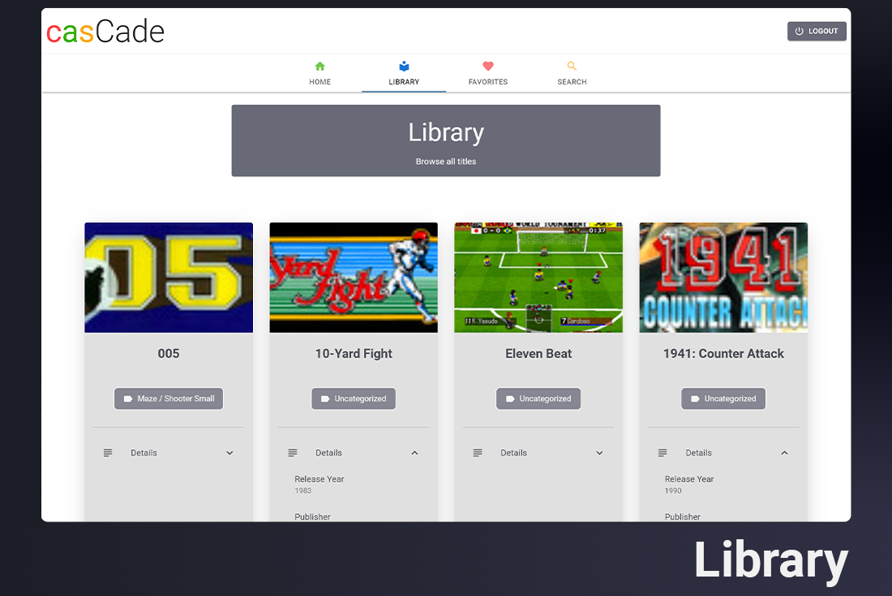

# [casCade &#8211; A Classic Arcade Web App](https://cascade-app.herokuapp.com/)

## Table of Contents
  - [About](#about)
  - [Getting Started](#getting-started)
     - [Online Demo](#online-demo)
     - [Local Installation](#local-installation)
   - [Usage](#usage)
     - [Home](#home)
     - [Library](#library)
     - [Favorites](#favorites)
     - [Search](#search)
     - [Game Player](#game-player)
   - [Footnotes](#footnotes)

## About

CasCade is a classic arcade single-page application. This application provides an intuitive front-end layout powered by Archive.org’s Internet Arcade collection. I made this application to provide an easy-to-use, inviting design that allows users to access and play their arcade favorites. 

This application offers multiple views to access the game library, including Library, Favorites, Search, and Shuffle. This app was built using React, RESTful APIs via [json-server](https://github.com/typicode/json-server), [notistack notification library](https://github.com/iamhosseindhv/notistack), and styled with [Material-UI](https://github.com/mui-org/material-ui).

## Getting Started

### Online Demo

A working demo is available on Heroku<sup id="a1">[1](#f1)</sup> at [https://cascade-app.herokuapp.com/](https://cascade-app.herokuapp.com/).

Register a new account<sup id="a2">[2](#f2)</sup> or use the email address `test@test.com` to login and browse the app.

### Local Installation

1.  Download and install [Node.js and npm](https://docs.npmjs.com/downloading-and-installing-node-js-and-npm).
    - If Node.js and npm are already installed, use `node -v && npm -v` to check the version and verify that both versions are `v10.24.1` & `6.14.13` or greater.
    - If the version is older than the minimum requirement, update to the latest stable version of [node](https://docs.npmjs.com/try-the-latest-stable-version-of-node) & [npm](https://docs.npmjs.com/try-the-latest-stable-version-of-npm).
2. Use [https or SSH](https://docs.github.com/en/github/authenticating-to-github/keeping-your-account-and-data-secure/about-authentication-to-github#authenticating-with-the-command-line) to clone the project folder to a local directory:
    ```Bash
    $ git clone ...
    ```
3. From the cloned project directory:
    ```Bash
    $ npm install
    ```
4. Install the JSON Server node package:
    ```Bash
    $ npm install -g json-server
    ```
5. Navigate ⬆ up from the cloned project one directory level, create a new directory and copy the default database.json file:
    ```Bash
    $ cd .. && mkdir ./casCade-database && cp ../casCade/api-base/database.json ./casCade-database
    ```
6. Move qto the casCade-database directory and launch JSON Server:
    ```Bash
    $ cd ./casCade-database && json-server --watch default-entries.json --port 8088
    ```
7.  Use your preferred code editor to find & replace the string `https://cascade-app.herokuapp.com/` with `http://localhost:8088/` in the following files:
    - `./src/components/auth/Login.js`
    - `./src/components/auth/Register.js`
    - `./src/components/favorites/FavoritesProvider.js`
8. From the project root directory, run the following:
    ```Bash
    $ npm start
    ```
9. Once casCade loads in the browser, click the Register tab to sign up for a new account and login.

## Usage

casCade is comprised of five sections:
- Home
- Library
- Favorites
- Search
- Game Player

### Home


Home provides basic getting started instructions, a minified search bar and shuffle option.

Using the search affordance will redirect you to the Search view to view the results. The shuffle option will select a game at random and load the game player.

### Library


Library provides a list of titles available from the Internet Arcade collection. To optimize the application, library results are limited to 150. This can be altered in the `LibraryList` react hook, located in `./src/components/library/Library`.

Game cards contain game details, notes, and favorite status. Game details include release date and publisher and category. If available, user notes are also displayed. The favorites button will add a game to the current user's favorites, if a title has already been added, this option will allow the user to redirect to the game title in favorites.

### Favorites


The Favorites view provides the same options as the Library view, with the addition of being able to add and edit notes and remove titles from the Favorites list.

Once a title is successfully modified, the browser displays a toast-style notification in the lower right-hand corner.

## Search


The Search view allows users to locate games by title and view any associated results. If the game does not exist in the database, the page will confirm that no matching results are found.

The Game cards provide the same features as the Library view.

## Game Player


Clicking the play button on any game card or using the Shuffle option will load the selected game to the player.

Selecting the power button above the game preview will load the game in the embedded emulator. The help button in the upper right corner will provide basic game controls. Game details are also available in the player.

---

## Footnotes
- <b id="f1">[1]</b> Heroku will periodically cycle apps into a [sleep state](https://blog.heroku.com/app_sleeping_on_heroku), please allow an additional moment on first load.  [↩](#a1)
- <b id="f2">[2]</b> Heroku will reset the `json-server` database to its default state from time to time, expect all demo account data to be removed.  [↩](#a2)